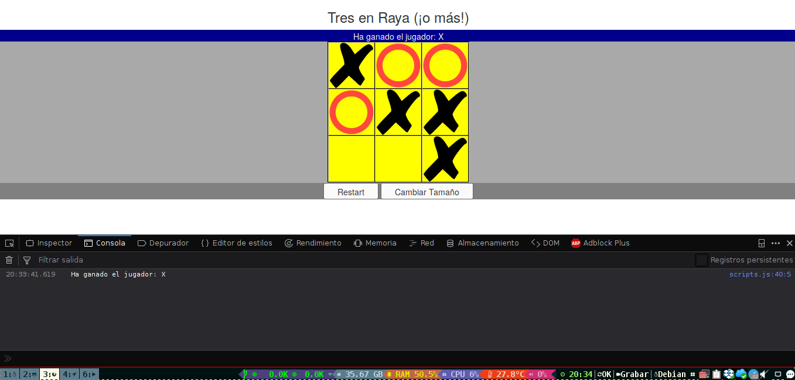

# Tres en Raya dinámico

Juego del tres en raya hecho con javascript (Actividad practicando JS)

Este mini-juego es objeto de práctica y puede servir como apuntes u 
orientación, pero no tiene como finalidad ser un juego optimizado para usar.



## Librerías extras

Aunque está programado en Javascript puro, se incluyen librerías de nodeJS 
para Jquery y Bootstrap, apenas se utilizan pero en el futuro puede que 
mejore a una nueva versión y las he dejado ya preparadas.

En el caso de que quieras instalarlas tendrás que tener node en el equipo y 
ejecutar en el mismo directorio:

```bash
    npm install
``` 

## Código y estructura

Este pequeño proyecto lo he realizado para refrescar algunas sintaxis de forma
que he utilizado algunas cosas innecesarias sin hacer falta, solo por 
practicarlas.

Al iniciar, se creará de forma automática una tabla que se enganchará al DOM.
Esta contendrá el juego que se irá marcando las casillas al ser pulsadas.

Existe una clase BaseFicha que es la base para los dos tipos de ficha:

- Equis()
- Circulo()

El juego se lleva a cabo en la clase Tablero() mientras la lógica y control a
modo de interfaz o librería intermedia se realiza desde **/assets/js/scripts
.js** mientras que las funciones auxiliares se encuentran dentro de ** 
/assets/js/functions.js**

## Reglas

Las reglas son idénticas al 3 en raya original salvo cuando modificamos el
número de cuadros que contiene, al hacerlo hay zonas más pequeñas (en 
diagonal) y solo se permiten las diagonales más largas (forma de X en el 
tablero).

